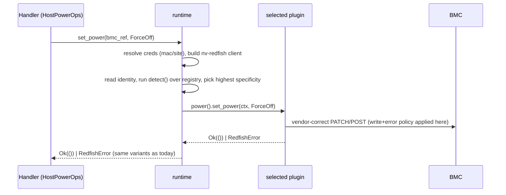

# Redfish Platform Plugin Architecture

Status: draft for review. Design-only; iterate before implementation.

## What This Changes (And What It Does Not)

NICo state controllers reach BMCs today through one dependency,
`Arc<dyn RedfishClientPool>`, which hands back a `Box<dyn Redfish>` from
`libredfish`. `libredfish` already behaves like a plugin system: a
`RedfishVendor` enum, per-vendor `Bmc` wrappers around a `RedfishStandard`
client, and a ~90-method `Redfish` trait. On top of that, NICo carries its
*own* layer of vendor/model branching scattered across `machine-controller`,
`site-explorer`, `preingestion-manager`, and `bmc-explorer` (see
[Vendor Workaround Inventory](#vendor-workaround-inventory)).

This design changes **only how controllers interface with Redfish**: it
replaces the single fat `Redfish` trait + scattered vendor `match`es with a
small set of capability traits backed by per-platform plugins. It deliberately
does **not** introduce new runtime governance, caching, session, or telemetry
machinery. Error types, metrics, and async job handling stay equivalent to
what NICo does today.

The two concrete wins:

1. Controllers depend on narrow capability traits instead of the whole
   `Redfish` surface, so handlers and their tests shrink.
2. Every vendor/model quirk — whether it lives in `libredfish` today or is
   smeared across NICo controllers — gets one obvious home: the plugin for that
   platform.

## Principles (Match Today, Don't Reinvent)

- **Errors are today's errors.** Reuse the existing flat error enum
  (`RedfishError`) and the existing `state_handler_redfish_error` mapping into
  `StateHandlerError::ExternalServiceError`. No new error taxonomy, no
  `Retryable` trait. "Retry" stays what it is today: a state handler returns
  `StateHandlerOutcome::wait(...)` and re-enters the state.
- **Metrics are today's metrics.** Keep the state-controller OTLP
  gauges/histograms and the `ExternalServiceError` metric labels
  (`redfish_*_error`). Do not add per-call spans or a per-plugin telemetry
  schema. At most, add `vendor`/`plugin` as a label on the existing error
  metric.
- **Async work is handled like today.** Vendor jobs and Redfish tasks are
  opaque id strings, persisted in controller DB state (as
  `set_boot_order_jid`, `uefi_password_jid`, `task_id`, `secure_erase_jid`,
  etc. are today) and polled on each controller iteration. No background job
  runner, no durable receipt format to design.
- **Clients are stateless per call.** Like today, the runtime resolves
  credentials and builds a client per operation; there is no long-lived BMC
  session to share, lock, or invalidate. Per-machine serialization stays the
  state machine's job, exactly as now.
- **First-party only.** All supported platforms are first-party crates compiled
  into the binary, just as all vendors live in `libredfish` today. No external
  plugin loading, no signed sidecars, no WASM, no allowlists.

## Explicit Non-Goals / Cut From Earlier Drafts

These were in an earlier draft and are removed as unnecessary for the actual
job (changing the controller↔Redfish interface):

- The support/validation **governance**: allowlist/denylist policy, support-level
  gates, and `MissingPluginBehavior`. Today selection is automatic and
  ungoverned; keep it that way. (A lightweight `SupportLevel` enum survives as
  informational metadata on `PlatformMetadata` — e.g. HPE starts `Candidate` —
  but it is not a runtime policy gate.)
- External/third-party plugin workflow, `inventory`/`linkme` discovery, signed
  sidecar/WASM v2.
- A separate `Capability` enum + `CapabilityManifest` + `CapabilitySupport`.
  "Unsupported" is expressed exactly as today: the capability accessor returns
  `None` (or the method returns `RedfishError::NotSupported`).
- `OperationReceipt` with `ReadbackHint`/`NoopAlreadySatisfied`. Readback is
  controller logic today and stays there; "already satisfied" is already
  `RedfishError::UnnecessaryOperation`.
- `PlatformMatchScore` (4 levels) + `MatchSignal` vectors.
- Runtime-owned identity cache and "lazy capability read cache" with
  invalidation rules.
- Generated HCL support matrices and the agentic plugin-generation workflow.
  These can be separate, later docs; they are not part of the interface change.

Also do **not** push `NvRedfishClientPool`, plugin registries, credential
managers, or BMC sessions into state-handler context. That boundary mistake is
what motivated this redesign.

## Crate Boundaries

Three crates, not five. There is no external-plugin requirement, so per-vendor
crates are unnecessary ceremony; vendors are modules in one plugins crate,
mirroring how `libredfish` keeps `dell.rs`, `hpe.rs`, etc. in one crate.

```text
crates/redfish-platform-api/
  Stable, transport-free contract (no nv-redfish dependency):
  RedfishPlatformService + capability sub-traits, BmcRef,
  request/response DTOs, RedfishError (the shared error, see below),
  PlatformPlugin trait, PlatformIdentity, the RedfishOps façade, and
  PlatformExecutionContext. Depends only on serde/serde_json/async-trait.

crates/redfish-platform-runtime/
  Credential resolution, nv-redfish client creation, the single
  nv-redfish implementation of RedfishOps, deterministic plugin
  selection, dispatch to the selected plugin, and the
  RedfishError -> StateHandlerError mapping helper.

crates/redfish-platform-plugins/
  One crate, per-platform modules: standard, hpe, and (to come) dell,
  lenovo, ami (+ lenovo-ami/gb300), nvidia_dpu, nvidia_viking,
  nvidia_gh200, nvidia_gbx00, nvidia_gbswitch, supermicro, power shelves.
  Depends only on the API crate + serde_json (no nv-redfish). Plus
  register_all(builder).
```

Dependency direction:

```text
machine-controller / site-explorer / preingestion-manager / api handlers
    -> redfish-platform-api            (traits + DTOs only)

api-core / binary
    -> redfish-platform-runtime
    -> redfish-platform-plugins

redfish-platform-runtime -> redfish-platform-api, nv-redfish, secrets/db adapters
redfish-platform-plugins -> redfish-platform-api  (+ serde_json; no nv-redfish)
```

`carbide-redfish` (`crates/redfish`) is not the contract crate: it depends on
`libredfish`, `api-model`, secrets, and state-controller glue, and controllers
should not inherit that surface.

## Error Model (Reused, Not New)

The contract returns the same flat error NICo uses today. Lift the current
`libredfish::RedfishError` variants into `redfish-platform-api` as
`RedfishError` so plugins built on `nv-redfish` produce the identical error
vocabulary controllers already match on:

```rust
pub enum RedfishError {
    NetworkError { url: String, source: TransportError },
    HttpErrorCode { url: String, status_code: u16, response_body: String },
    JsonDeserializeError { url: String, body: String, source: JsonError },
    NoContent,
    NoHeader,
    MissingBootOption(String),
    UnnecessaryOperation,             // e.g. power-on when already on (Dell 409)
    MissingKey { key: String, url: String },
    InvalidValue { url: String, field: String, err: String },
    Lockdown,                         // operation blocked by an active lockdown
    NotSupported(String),             // capability/op not available on this platform
    UserNotFound(String),
    MissingVendor,
    PasswordChangeRequired,
    TooManyUsers,
    NoDpu,                            // zero-DPU host
    GenericError { error: String },
}

impl RedfishError {
    pub fn is_unauthorized(&self) -> bool { /* 401/403 */ }
    pub fn not_found(&self) -> bool { /* 404 */ }
}
```

Controllers keep mapping it the same way, with the same metric labels:

```rust
// unchanged from crates/redfish/src/libredfish/error.rs today
pub fn state_handler_redfish_error(
    operation: &'static str,
    error: RedfishError,
) -> StateHandlerError {
    ExternalServiceError::with_source(
        "redfish",
        operation,
        error.to_string(),
        redfish_operation_metric_label(operation), // redfish_restart_error, ...
        error,
    )
    .into()
}
```

Why no `is_retryable()`: today retry is decided by the *handler*, by variant,
not by a generalized flag (e.g. "`NotSupported` lockdown ⇒ treat as disabled",
"client create failed ⇒ `wait`", "Dell 404 on `get_task` ⇒ check version").
Those decisions stay in the controllers. The contract's only job is to surface
the same variants so those existing decisions keep working.

## Controller-Facing Contract

Controllers see capability sub-traits, one per capability group. A handler
takes only what it uses, so its mock stays small. The umbrella
`RedfishPlatformService` composes them for callers (and runtime registration)
that want everything; with trait upcasting (stable since Rust 1.86, and the
repo pins 1.95) an `Arc<dyn RedfishPlatformService>` narrows to any single
sub-trait.

All methods are keyed by `BmcRef`; the runtime resolves credentials, builds the
`nv-redfish` client, selects the plugin, and dispatches — per call, like today.

```rust
#[async_trait::async_trait]
pub trait PlatformSelection: Send + Sync {
    // Read-only: which plugin handles this BMC, for logging/branching.
    async fn selected_platform(&self, bmc: BmcRef) -> Result<SelectedPlatform, RedfishError>;
}

#[async_trait::async_trait]
pub trait HostPowerOps: Send + Sync {
    async fn power_state(&self, bmc: BmcRef) -> Result<PowerState, RedfishError>;
    async fn set_power(&self, bmc: BmcRef, action: PowerAction) -> Result<(), RedfishError>;
    // Replaces today's scattered `needs_ipmi_restart()` vendor matches:
    // the plugin declares whether a host reset must go out-of-band (IPMI).
    fn host_reset_transport(&self, p: &SelectedPlatform) -> ResetTransport;
}

#[async_trait::async_trait]
pub trait BmcResetOps: Send + Sync {
    async fn bmc_status(&self, bmc: BmcRef) -> Result<BmcStatus, RedfishError>;
    async fn reset_bmc(&self, bmc: BmcRef, kind: BmcResetKind) -> Result<(), RedfishError>;
}

// MachineSetup also owns NVRAM clear and the UEFI/BIOS setup password.
#[async_trait::async_trait]
pub trait MachineSetupOps: Send + Sync {
    async fn apply_machine_setup(&self, bmc: BmcRef, req: MachineSetupRequest)
        -> Result<JobHandle, RedfishError>;
    async fn machine_setup_status(&self, bmc: BmcRef) -> Result<MachineSetupStatus, RedfishError>;
    async fn set_uefi_password(&self, bmc: BmcRef, req: UefiPasswordRequest)
        -> Result<JobHandle, RedfishError>;
    async fn clear_nvram(&self, bmc: BmcRef) -> Result<(), RedfishError>;
}

#[async_trait::async_trait]
pub trait BootOrderOps: Send + Sync {
    // A host-BMC op: order the host to boot from its DPU NIC first. (Distinct
    // from operating the DPU's own BMC; NoDpu surfaces here on DPU-less hosts.)
    async fn set_dpu_first_boot(&self, bmc: BmcRef, req: BootOrderRequest)
        -> Result<JobHandle, RedfishError>;
    async fn boot_order_status(&self, bmc: BmcRef) -> Result<BootOrderStatus, RedfishError>;
    async fn set_infinite_boot(&self, bmc: BmcRef, enabled: bool) -> Result<JobHandle, RedfishError>;
}

#[async_trait::async_trait]
pub trait SecureBootOps: Send + Sync {
    async fn secure_boot_status(&self, bmc: BmcRef) -> Result<SecureBootStatus, RedfishError>;
    async fn set_secure_boot(&self, bmc: BmcRef, enabled: bool) -> Result<(), RedfishError>;
    async fn add_certificate(&self, bmc: BmcRef, req: SecureBootCertificateRequest)
        -> Result<JobHandle, RedfishError>;
}

// Host and BMC lockdown are separate knobs (workflows disable BMC-only
// lockdown during BIOS/BOSS ops and re-enable after). These act on whichever
// BMC the BmcRef points at; a DPU BMC's own lockdown is just this trait
// implemented by the DPU plugin.
#[async_trait::async_trait]
pub trait LockdownOps: Send + Sync {
    async fn lockdown_status(&self, bmc: BmcRef) -> Result<LockdownStatus, RedfishError>;
    async fn set_host_lockdown(&self, bmc: BmcRef, enabled: bool) -> Result<(), RedfishError>;
    async fn set_bmc_lockdown(&self, bmc: BmcRef, enabled: bool) -> Result<(), RedfishError>;
}

#[async_trait::async_trait]
pub trait BmcAccountOps: Send + Sync {
    async fn ensure_user(&self, bmc: BmcRef, req: BmcUserRequest) -> Result<(), RedfishError>;
    async fn delete_user(&self, bmc: BmcRef, req: BmcDeleteUserRequest) -> Result<(), RedfishError>;
    async fn change_password(&self, bmc: BmcRef, req: BmcPasswordRequest) -> Result<(), RedfishError>;
    async fn set_account_policy(&self, bmc: BmcRef, req: BmcAccountPolicyRequest)
        -> Result<(), RedfishError>;
}

// A DPU is its own BMC (endpoint_kind: DpuBmc), matched to the nvidia_dpu
// plugin and driven through the generic traits above (power, reset, boot,
// machine setup, firmware) against the DPU's own BmcRef. DpuOps holds only the
// operations with no host-BMC analog -- NIC mode and host-rshim -- and is
// implemented solely by DPU-BMC plugins, the same way StorageOps is Dell-only.
#[async_trait::async_trait]
pub trait DpuOps: Send + Sync {
    async fn nic_mode(&self, bmc: BmcRef) -> Result<DpuNicModeStatus, RedfishError>;
    async fn set_nic_mode(&self, bmc: BmcRef, req: DpuNicModeRequest) -> Result<(), RedfishError>;
    async fn set_host_rshim(&self, bmc: BmcRef, enabled: bool) -> Result<(), RedfishError>;
}

#[async_trait::async_trait]
pub trait FirmwareOps: Send + Sync {
    async fn start_update(&self, bmc: BmcRef, req: FirmwareUpdateRequest)
        -> Result<JobHandle, RedfishError>;
    async fn firmware_inventory(&self, bmc: BmcRef) -> Result<FirmwareInventory, RedfishError>;
}

// Dell BOSS exists today (get_boss_controller / decommission / create_volume),
// so it is in v1, not deferred.
#[async_trait::async_trait]
pub trait StorageOps: Send + Sync {
    async fn boss_controller(&self, bmc: BmcRef) -> Result<Option<BossController>, RedfishError>;
    async fn decommission(&self, bmc: BmcRef, req: DecommissionRequest)
        -> Result<JobHandle, RedfishError>;
    async fn create_volume(&self, bmc: BmcRef, req: CreateVolumeRequest)
        -> Result<JobHandle, RedfishError>;
}

// Polling for any capability that returned a JobHandle. One place, so
// controllers persist and resume uniformly (mirrors get_task/get_job_state).
#[async_trait::async_trait]
pub trait JobPollOps: Send + Sync {
    async fn poll(&self, bmc: BmcRef, job: &JobHandle) -> Result<JobState, RedfishError>;
}

pub trait RedfishPlatformService:
    PlatformSelection + HostPowerOps + BmcResetOps + MachineSetupOps + BootOrderOps
    + SecureBootOps + LockdownOps + BmcAccountOps + DpuOps + FirmwareOps
    + StorageOps + JobPollOps
{}
```

### Async work: one handle type, persisted as a string

There is no `OperationReceipt`/`ReadbackHint` enum. Mutations that complete
immediately return `Result<(), RedfishError>`. Mutations that the BMC runs
asynchronously (firmware tasks, Dell BIOS/BOSS jobs, UEFI-password jobs,
secure-boot cert upload) return a `JobHandle`:

```rust
pub struct JobHandle {
    pub kind: JobKind,        // RedfishTask | VendorJob
    pub id: String,           // BMC-side id; opaque to controllers
}

pub enum JobState { Pending, Running { percent: Option<u8> }, Completed, Failed { detail: String } }
```

`JobHandle` is a plain serializable string id, persisted in controller DB state
exactly like `set_boot_order_jid`/`task_id` today, and polled via
`JobPollOps::poll` on each iteration. It is a BMC-side id, so it survives
process restarts with no extra design, and plugin-version skew is a non-issue
(plugins are first-party and compiled in). This is the same lifecycle NICo runs
today, just behind one `poll` method instead of `get_task` + `get_job_state`.

### `BmcRef` and system selection

```rust
pub struct BmcRef {
    pub machine_id: Option<MachineId>,
    pub site_id: Option<SiteId>,
    pub address: SocketAddr,
    pub mac_address: Option<MacAddress>,   // credential key today
    pub endpoint_kind: BmcEndpointKind,    // HostBmc | DpuBmc | PowerShelfBmc | SwitchBmc | Unknown
    pub platform_hint: Option<PluginId>,   // advisory selection cache (see below)
}
```

`BmcRef` carries no DB handles or controller context. Multi-system enclosures
are handled the way `libredfish` does today: the runtime picks the canonical
`system_id` during client/plugin creation (e.g. prefer `System_0`, Dell
`System.Embedded.1`), so each `BmcRef` resolves to one logical system. If a
future need arises to target a specific system explicitly, add an optional
selector then; it is not needed to match current behavior.

A DPU is not a sub-resource of the host — it is its own BMC with its own
Redfish endpoint, address, and credentials. It is therefore its own `BmcRef`
(`endpoint_kind: DpuBmc`), selected to the `nvidia_dpu` plugin, and driven
through the same generic capability traits as any other BMC. So "talk to the
DPU" means "issue a normal capability call against the DPU's `BmcRef`," not a
special DPU code path on the host. The genuinely DPU-only operations (NIC mode,
host-rshim) are the `DpuOps` capability that only DPU plugins implement; the
host-side DPU touchpoints are exactly two — `BootOrderOps::set_dpu_first_boot`
(host boots from its DPU) and the `NoDpu` error on DPU-less hosts.

## Plugin Contract

A plugin advertises which capabilities it implements via `Option` accessors —
the same "absent ⇒ unsupported" idiom NICo uses today (`RedfishStandard`
returns `NotSupported` for vendor methods it lacks). The runtime maps a `None`
accessor to `RedfishError::NotSupported` at the service boundary.

```rust
pub trait PlatformPlugin: Send + Sync {
    fn metadata(&self) -> &'static PlatformMetadata;       // id, vendor, models
    fn detect(&self, identity: &PlatformIdentity) -> Option<MatchSpecificity>;

    fn power(&self)         -> Option<&dyn HostPowerCap>   { None }
    fn bmc_reset(&self)     -> Option<&dyn BmcResetCap>    { None }
    fn machine_setup(&self) -> Option<&dyn MachineSetupCap>{ None }
    fn boot_order(&self)    -> Option<&dyn BootOrderCap>   { None }
    fn secure_boot(&self)   -> Option<&dyn SecureBootCap>  { None }
    fn lockdown(&self)      -> Option<&dyn LockdownCap>    { None }
    fn accounts(&self)      -> Option<&dyn BmcAccountCap>  { None }
    fn dpu(&self)           -> Option<&dyn DpuCap>         { None }
    fn firmware(&self)      -> Option<&dyn FirmwareCap>    { None }
    fn storage(&self)       -> Option<&dyn StorageCap>     { None }
}
```

The `*Cap` traits mirror the controller-facing `*Ops` traits one-to-one, with
one difference: they take a `PlatformExecutionContext` instead of a `BmcRef`
(the runtime has already resolved creds and selected the plugin). This is the
only intentional duplication — the runtime boundary — and the names line up so
the mapping is mechanical. There is no third vocabulary (no `Capability` enum).

Plugins reach the BMC **only** through a high-level, JSON-shaped façade,
`RedfishOps` — never `nv-redfish` directly. This keeps the plugin crate free of
transport types (it depends only on the API crate plus `serde_json`), keeps all
transport and action plumbing in one place (the runtime), and makes a plugin
read like the curl probe that produced it. The runtime owns the single
`nv-redfish` implementation of the façade. PATCHes use `If-Match: *`
(last-writer-wins), matching NICo's single-writer model and the vendors that
require a wildcard `If-Match`; there is no optimistic-concurrency ETag round
trip.

```rust
#[async_trait]
pub trait RedfishOps: Send + Sync {
    async fn get(&self, path: &str) -> Result<serde_json::Value, RedfishError>;
    async fn patch(&self, path: &str, body: serde_json::Value) -> Result<(), RedfishError>;
    async fn post_action(&self, path: &str, body: serde_json::Value)
        -> Result<serde_json::Value, RedfishError>;
    async fn create(&self, path: &str, body: serde_json::Value)
        -> Result<serde_json::Value, RedfishError>;
    async fn delete(&self, path: &str) -> Result<(), RedfishError>;
    async fn system_path(&self) -> Result<String, RedfishError>;   // canonical first system
    async fn manager_path(&self) -> Result<String, RedfishError>;  // canonical first manager
}

pub struct PlatformExecutionContext<'a> {
    ops: &'a dyn RedfishOps,
    identity: &'a PlatformIdentity,
    timeout: OperationTimeout,
}
```

The context exposes no transport, DB transactions, controller state, or secret
internals. Capability impls do their own lazy reads through `ctx.ops().get(...)`
(BIOS, SecureBoot, firmware inventory, OEM resources) when needed, and shared
`standard` providers cover the conventional Redfish shapes (power, reset, etc.)
on top of the same façade.

### Detection is a pure function of evidence

`detect` is synchronous and pure — no session, no I/O — which resolves the
earlier draft's contradiction (it claimed `match_platform` could do lazy reads
despite having no session). `PlatformIdentity` carries exactly the cheap
evidence today's detection uses, so no lazy read is required to select:

```rust
pub struct PlatformIdentity {
    pub service_root_vendor: Option<String>,   // "Dell", "HPE", "NVIDIA", "AMI", ...
    pub service_root_product: Option<String>,  // "P3809", "GB200 NVL", "GB BMC"
    pub service_root_oem_keys: Vec<String>,    // e.g. contains "Ami" => Lenovo-AMI
    pub manager_id: Option<String>,            // "BMC"
    pub manager_firmware_version: Option<String>,
    pub system_id: Option<String>,             // "DGX", "System_0", "System.Embedded.1"
    pub system_manufacturer: Option<String>,
    pub system_model: Option<String>,          // model contains "GB300", "SR650 V4", ...
    pub chassis_ids: Vec<String>,              // "MGX_NVSwitch_0", "Chassis_0"
}
```

The runtime collects this from cheap reads (service root, managers, first
system, chassis ids) — the same inputs `libredfish` and `bmc-explorer::hw_type`
use today. Firmware-version *gates* on individual capabilities (e.g. DPU
NicMode below `BF-23.10-5`) are not selection inputs; they are handled inside
the capability via a lazy read, returning `NotSupported` when gated out, as
today.

```rust
pub enum MatchSpecificity { Generic, Vendor, Model }
```

Selection is deterministic: every registered plugin's `detect` runs, the
highest specificity wins (`Model` > `Vendor` > `Generic`), and the `standard`
plugin returns `Some(Generic)` for everything as the floor. This captures
today's layered refinement directly: `NvidiaViking`/`LenovoAmi`/`*Gb300` are
`Model` and outrank the `AMI` `Vendor` plugin; `NvidiaGH200`/`NvidiaGBSwitch`
(P3809 + chassis id) outrank generic NVIDIA. A true tie between two `Model`
plugins is a registration bug and fails closed.

## How One Call Flows



By default selection runs per call from cheap reads (as `libredfish` does
today). To avoid re-identifying a known BMC on every operation, the caller may
attach an advisory **plugin hint** to `BmcRef` (`platform_hint:
Option<PluginId>`) — typically the plugin id stored for that endpoint during
site exploration, which already reads everything selection needs. When the hint
names a registered plugin, the runtime skips identity-gathering and uses it
directly; identity stays the cheap vendor/product already in hand from the
service root. On a missing/unregistered hint it falls back to the live identify
path, so identification remains the source of truth and the cold-start path.

The hint is a cache, never authority: it is populated where the reads already
happen (exploration), persisted (so it is shared across controllers and
survives restarts), and invalidated by the lifecycle events that already exist
(re-exploration, re-ingestion, firmware update). Selection is coarse
(vendor/model) and rarely changes for a given endpoint; firmware-level
divergence is handled inside capabilities by probing, not by selection — so a
stale hint is low-risk, and if the hardware truly changed, capability calls
fail and the controller re-explores. This is deliberately a `BmcRef` field, not
a separate injected provider: the caller already builds `BmcRef` and already
does the DB lookups, so the hint rides along with no extra machinery, and the
runtime stays free of database access.

## Vendor Workaround Inventory

The point of plugins is to give every quirk one home. Quirks come from two
places today — inside `libredfish` per-vendor `Bmc` wrappers, and scattered
across NICo controllers — and both collapse into the owning plugin. Each quirk
classifies as one of: **detection**, **write policy**, **error policy**, **job
policy**, **boot policy**, **lockdown policy**, **account policy**, or
**transport** (incl. non-Redfish fallback).

Representative entries (not exhaustive; the full catalog from `libredfish` and
the NICo crates feeds the per-plugin checklists):

| Platform | Quirk | Class | Home |
|---|---|---|---|
| Dell | BIOS via `/Bios/Settings` + `SettingsApplyTime: OnReset`, returns job id from `Location` | write + job | `dell::machine_setup`/`boot_order` |
| Dell | `create_user` reuses disabled iDRAC slots (IDs 3–16) | account | `dell::accounts` |
| Dell | redundant power ⇒ HTTP 409 ⇒ `UnnecessaryOperation` | error | `dell::power` |
| Dell | `get_task` 404 after UEFI update ⇒ confirm by version match | error | `dell::firmware` |
| Dell | skip post-BMC-update `bmc_reset` (currently a controller `if vendor==Dell`) | error/job | `dell::firmware` |
| Dell | BOSS LC-ready gate, decommission/create-volume job ids | job | `dell::storage` |
| Dell | UEFI password clear via ImportSystemConfiguration fallback | write | `dell::machine_setup` |
| HPE | one retry on non-timeout connection RST (iLO reuse); iLO<7 `Connection: close` | transport | `hpe` client |
| HPE | intermittent 401 ⇒ retry up to 5 (currently in site-explorer) | error | `hpe` |
| HPE | boot via `UrlBootFile`/OEM boot order, not standard override | boot/write | `hpe::boot_order` |
| HPE | KCS lockdown gated on iLO ≥ 6.1.40 | lockdown | `hpe::lockdown` |
| HPE | swallow `UnableToModifyDuringSystemPOST` on boot set | error | `hpe::boot_order` |
| Lenovo | SR675 V3 OVX `ForceRestart` ⇒ ForceOff+sleep+On (fw-gated) | error/power | `lenovo::power` |
| Lenovo | SR650 V4 Redfish reset kills DPUs ⇒ **IPMI** chassis reset | transport | `lenovo::power.host_reset_transport` |
| Lenovo | boot order OEM `NetworkBootOrder`, 404 ⇒ BIOS attr (fw split) | boot | `lenovo::boot_order` |
| Lenovo | post-NIC-FW BMC reset, IPMI cold-reset fallback (FORGE-3864) | transport | `lenovo::bmc_reset` |
| AMI / LenovoAMI | `If-Match: *` on password/BIOS/boot/secure-boot; `/Bios/SD` pending | write | `ami` |
| GB300 | attribute renames (TPM `TCG006TPMClear`, infinite-boot `LEM0003`), no `clear_nvram` | write/cap | `ami::gb300` |
| Viking (DGX) | boot order on `/Systems/SD` with ETag If-Match | write | `nvidia_viking::boot_order` |
| Viking | boot-order remediation skipped (known BMC fw issue); pwd id `"2"` | error/account | `nvidia_viking` |
| Viking | `FirmwareInventory` 403 (intermittent), CPLDMB_0 version gate | error | `nvidia_viking::firmware` |
| DPU (BF) | NicMode fw gates; BIOS 500 in NIC mode ⇒ infer from error body | error/detection | `nvidia_dpu::dpu` |
| DPU | empty BIOS attrs ⇒ ForceRestart; rshim via OEM action | error/write | `nvidia_dpu` |
| GBx00 | no lockdown (no-op); `EmbeddedUefiShell` infinite-boot inversion; fw version trim | cap/write | `nvidia_gbx00` |
| GBx00 | factory password PATCH via `Unknown` client to dodge `PasswordChangeRequired` on `/Systems` | account | `nvidia_gbx00::accounts` |
| GH200 | no power metrics; boot options matched by display-name prefix; username account ids | cap/account | `nvidia_gh200` |
| Supermicro | KCS 404 on Grace-Grace ⇒ OK; post-unlock host reboot for stale boot order | error/boot | `supermicro` |
| Power shelves | no `/Systems`; PSU power actions; most host ops `NotSupported` | cap | `liteon`/`delta` |

Two consequences worth calling out:

- **NICo-side vendor `match`es move into plugins.** Branches like the
  `vendor.is_lenovo()` ACPowercycle choice, the Viking `is_dgx_h100()`
  boot-order skip, the Dell `bmc_reset` skip, the GBx00 factory-password path,
  and the HPE 401 retry stop being controller conditionals and become plugin
  behavior or a plugin capability query.
- **Non-Redfish fallback stays out-of-band but is plugin-decided.** IPMI cold
  reset is not a Redfish operation and is **not** added to the platform
  service. Instead the plugin answers `host_reset_transport(...) ->
  Redfish | Ipmi`, replacing the hardcoded `needs_ipmi_restart()` vendor/model
  match in `machine-controller`. The controller still owns the IPMI tool and
  performs the reset; it just asks the plugin which transport to use. The same
  pattern fits other non-Redfish escapes (e.g. Lenovo `mnv_cli` M.2 cleanup):
  the plugin declares the need, the controller owns the tool.

## Standard Providers And Reuse

Composition, not inheritance — the same shape `libredfish` already uses
(`dell::Bmc { s: RedfishStandard }`). Shared helpers live once:

- `StandardResourceProvider`: service root, collections, members, `$expand`,
  systems/managers/chassis.
- `StandardHostPowerProvider`: `ComputerSystem.Reset` with action-info /
  allowable-value validation.
- `StandardBmcResetProvider`: `Manager.Reset`.
- `StandardJobProvider`: Redfish `TaskService` polling **and** `Location`/job-id
  parsing for vendor jobs (one `JobPollOps` impl over both).
- `StandardBiosSettingsProvider`: BIOS read, pending settings, clear-pending,
  settings-URL handling.
- `StandardBootProvider`: boot override / order, parameterized by write policy.
- `StandardSecureBootProvider`, `StandardAccountProvider`,
  `MultipartFirmwareProvider` (configurable endpoint, parts, preserve-config,
  task extraction, target mapping).

A vendor plugin delegates to these and overrides only its model/firmware
quirks. The `standard` plugin is the `Unknown`-vendor floor, matching today's
fallback to bare `RedfishStandard`.

## Site Explorer And Preingestion

Same boundary, no behavior change:

- `explore_endpoint` and report generation stay in the generic `nv-redfish`
  path. Plugins never generate inventory reports.
- Reset, power, secure boot, lockdown, machine setup, boot order, DPU NIC mode,
  NVRAM clear, and account ops route through `RedfishPlatformService`.
- Site-explorer keeps exploration scheduling, last-error policy, expected
  credential selection, vault side effects, and remediation decisions
  (including escalation to IPMI BMC reset as a last resort).
- Preingestion keeps its recovery/scheduling policy and uses the service for
  BMC reset, power, BFB recovery cycles, and firmware.

## State Controller Integration

State controllers swap one dependency. Where they hold
`Arc<dyn RedfishClientPool>` today, they hold `Arc<dyn RedfishPlatformService>`
(or a narrower sub-trait, e.g. `Arc<dyn HostPowerOps>`), depending only on
`redfish-platform-api`. They no longer receive `NvRedfishClientPool`, a
registry, plugin instances, a credential manager, or any cache. Controller side
effects (reboot timestamps, transition state, DB writes) stay in controller
code; only the BMC interaction moves behind the service.

## Migration Plan

`libredfish` becomes a mining source, migrated one capability family at a time
so each step is shippable:

1. Land `redfish-platform-api` (traits, DTOs, `RedfishError`, `JobHandle`) with
   mock implementations; add controller/site-explorer mock-service tests
   without changing runtime behavior.
2. Land `redfish-platform-runtime` (credential resolution, nv-redfish client
   creation, deterministic selection, dispatch, error mapping) and the
   `standard` + per-vendor plugin modules with `detect` rules ported from
   `service_root.rs` + `bmc-explorer::hw_type`.
3. Migrate callers family by family, starting with host power and BMC reset,
   then machine/BIOS setup + job polling, boot order, lockdown, secure boot,
   UEFI password, firmware, DPU, and Dell BOSS. As each family migrates, delete
   the corresponding NICo-side vendor `match`es into the plugin.

Optional de-risking: a plugin may initially delegate to `libredfish` internally
behind the new capability traits, letting the interface flip before each quirk
is reimplemented on `nv-redfish`. This keeps behavior identical during the
swap; it is a transition aid, not the end state.

## Testing

Layers (trimmed to what guards the contract):

- API-crate compile tests with mock service + mock plugin.
- Plugin `detect` tests from sanitized `PlatformIdentity` fixtures derived from
  curl probes.
- Capability tests using ordered HTTP expectations derived from curl artifacts
  (strict mock; do not reuse legacy mock behavior that treats any existing path
  as a successful write).
- Runtime selection tests (specificity ordering, tie ⇒ fail closed, `Unknown` ⇒
  standard).
- Controller and preingestion tests against the mock service.
- Manual real-BMC validation for destructive operations.

Tests must assert unsupported behavior explicitly: an unimplemented capability
returns `None`/`NotSupported`, and that is part of the contract.

Fixtures: commit only sanitized, minimal curl artifacts and derived identities
under `crates/redfish-platform-plugins/<vendor>/tests/fixtures/...`; scrub
credentials, tokens, private IPs/hostnames, certs/session ids, account names,
and serials; deterministically rewrite MACs/UUIDs/ids so relationships stay
testable.

## Plugin Generation Skill

Add a Cursor skill (e.g. `crates/redfish-platform-plugins/.cursor/skills/
generate-redfish-plugin/`) that bootstraps a plugin draft by probing a real
BMC. The skill is curl-first and read-only: it does not link `nv-redfish` or
NICo to explore, so it works against any reachable BMC with nothing but HTTP.

Inputs (all the skill needs):

- NICo context: this doc plus the `redfish-platform-api` crate (the contract —
  capability traits, `PlatformIdentity`, `MatchSpecificity`, `RedfishError`,
  `JobHandle`).
- BMC IP/hostname, username, password.
- Optional factory-default (or previous) credentials, used only to characterize
  the first-boot password-change flow and credential rotation.

Read-only probe sequence (stops as soon as identity is unambiguous):

```bash
export BMC="https://$BMC_HOST" U="$BMC_USER" P="$BMC_PASSWORD"
curl -sk -u "$U:$P" "$BMC/redfish/v1/"                 # vendor, product, OEM keys, Redfish version
curl -sk -u "$U:$P" "$BMC/redfish/v1/Managers"         # + first member: manager id, firmware
curl -sk -u "$U:$P" "$BMC/redfish/v1/Systems"          # + first member: manufacturer, model, SKU, boot, BIOS link
curl -sk -u "$U:$P" "$BMC/redfish/v1/Chassis"          # only when model identity is ambiguous (chassis ids)
# Capability-specific reads (ActionInfo, BIOS, SecureBoot, TaskService,
# UpdateService, AccountService, firmware inventory, OEM resources) only when
# drafting a specific capability.
```

These are exactly the fields `PlatformIdentity` carries and that `detect` keys
on, so the same probe both proposes the `detect` rule and seeds its fixture.

Generated output is a **review candidate**, never trusted automatically:

1. A new `crates/redfish-platform-plugins/<vendor>/` module with
   `PlatformMetadata`, a `detect` implementation, and the `MatchSpecificity` it
   claims (`Generic`/`Vendor`/`Model`), justified by the observed identity
   signals.
2. Capability accessors: implement only the capabilities the probe could verify
   read-only (status/inventory reads); leave mutating capabilities as `None`
   (so they surface `NotSupported`) until exercised and reviewed. Reuse the
   standard providers; emit only the vendor-specific write/error/job/boot/
   lockdown policy deltas (the eight quirk classes in
   [Vendor Workaround Inventory](#vendor-workaround-inventory)).
3. Sanitized curl artifacts and the derived `PlatformIdentity` fixture, scrubbed
   per the fixture rules above.
4. `detect` tests from the identity fixture and capability tests from the
   ordered read-only expectations.

Mutating operations are only emitted/validated when the operator explicitly
approves a mutating step against the BMC; the default run is read-only. The
skill never invents write policy it did not observe — an unverified mutation
stays `None`/`NotSupported` with a TODO referencing the probe, so a human
attaches the real write/job policy and a validation transcript before enabling
it.

## Open Questions

- Where exactly do firmware-version capability gates read best — a small helper
  on the execution context, or ad hoc lazy reads per capability?
- Do any current multi-node enclosures need an explicit per-system selector on
  `BmcRef`, or is canonical-`system_id` selection sufficient (as today)?
- The DPU is its own BMC and uses the generic capability traits via its own
  `BmcRef`; `DpuOps` (NIC mode, host-rshim) is the only DPU-specific surface.
  Open: should `DpuOps` live in this contract, or in a thin DPU-specific
  service that reuses the same runtime and plugin selection?
- Should `vendor`/`plugin_id` be added as a label on the existing
  `redfish_*_error` metric, or left out to keep cardinality flat?

