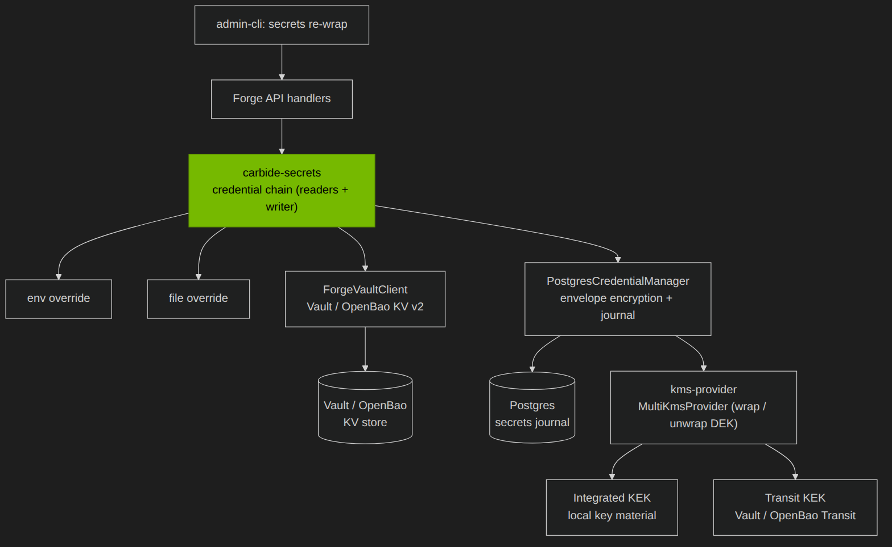
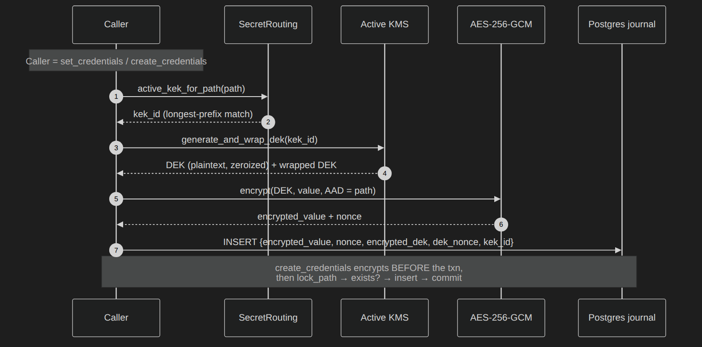
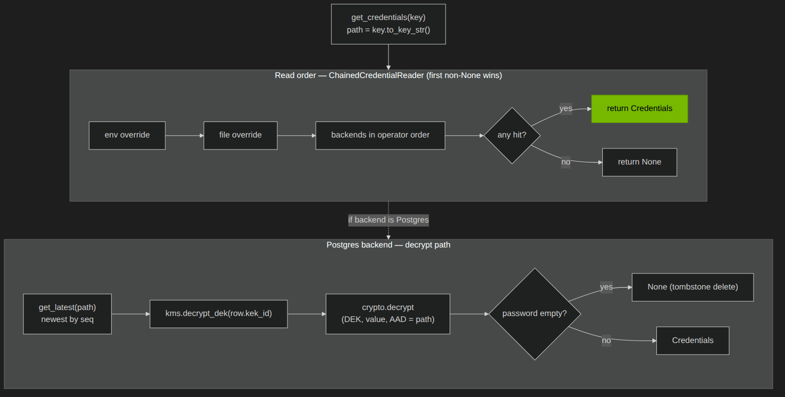
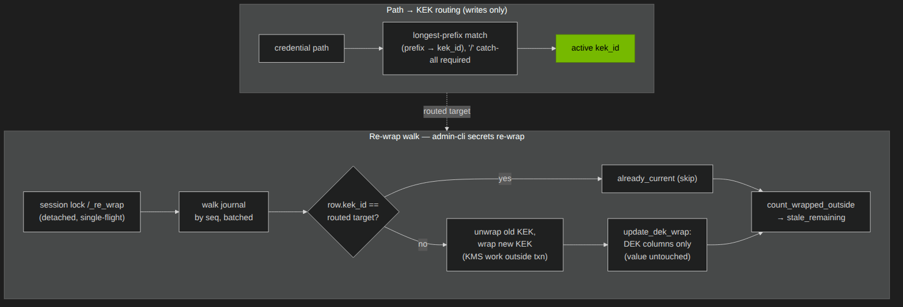
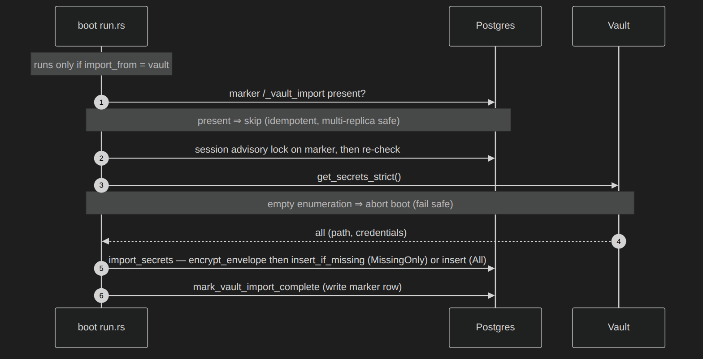
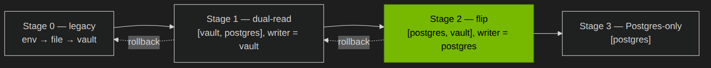

# Postgres-Backed Secret Storage With Envelope Encryption

## Software Design Document

## Revision History

| Version | Date | Modified By | Description |
| :---: | :---: | :---- | :---- |
| 0.1 | 2026-07-07 | Chet Nichols III | Initial version |

# 1. Introduction

This design document specifies the NICo Core secret-storage subsystem: a configurable credential chain introducing a Postgres-backed, envelope-encrypted secret store alongside the existing Vault/OpenBao store, together with the key-management layer protecting stored secrets. The default configuration reproduces today's behavior exactly, so adoption is opt-in and reversible at each step.

The document outlines the architecture, runtime flows, data model, configuration, and security considerations, and describes how the credential chain, its backends, and the key-encryption-key (KEK) providers interact.

## 1.1 Purpose

The purpose of this document is to articulate the design of the secret-storage subsystem, ensuring all stakeholders have a shared understanding of the solution, its components, and their interactions. It details the high-level and low-level design choices, architecture, and implementation details necessary for development and operation.

## 1.2 Definitions and Acronyms

| Term/Acronym | Definition |
| :---- | :---- |
| NICo | NVIDIA bare-metal life-cycle management system (project name: Bare metal manager) |
| SDD | Software Design Document |
| Vault | Secrets management system (OSS version: [OpenBao](https://openbao.org/)) |
| DEK | Data Encryption Key: a fresh 256-bit key generated per write, encrypting one secret value |
| KEK | Key Encryption Key: the key used to wrap (encrypt) a DEK; never applied to the value directly |
| Envelope encryption | Encrypt the value with a DEK, then wrap the DEK with a KEK; store both |
| AAD | Additional Authenticated Data: data bound into the AES-GCM authentication tag but not encrypted; here, the secret's path |
| KMS | Key Management Service; here, the KEK provider layer: the Integrated, Transit, and Multi providers (section 2.2) |
| `kek_id` | Opaque string naming a KEK; recorded on every stored row so a read can find the KEK used to wrap its DEK |
| Backend | A credential store answering reads and (for the writer) accepting writes: Postgres or Vault |
| Credential chain | The ordered readers (local overrides + backends) consulted first-match-wins, plus a single writer |
| Journal | The append-only `secrets` table; the newest row per path is authoritative |
| Transit | The Vault/OpenBao server-side cryptography engine; wraps and unwraps DEKs without exposing key material ([OpenBao Transit docs](https://openbao.org/docs/secrets/transit/)) |

## 1.3 Scope

This SDD covers the credential abstraction (`carbide-secrets`), the Postgres backend and its envelope encryption (the `carbide-api-core` secrets module), the key-encryption-key layer (`carbide-kms-provider`), the boot-time chain assembly and configuration, the operator re-wrap command, and the one-time Vault → Postgres import.

Out of scope: the password-rotation engine (a separate design), application-level use of individual credentials, and the PKI certificate-issuance path.

### 1.3.1 Assumptions, Constraints, Dependencies

**Assumptions**

* Postgres is the operational database NICo Core already depends on; the secret store is a new table in it, not a new datastore.
* A KEK provider is available: either local key material (Integrated) or a reachable Vault/OpenBao Transit engine.
* Existing credentials live in Vault/OpenBao KV and remain readable during a migration.
* Callers address a credential by a stable path string (`CredentialKey::to_key_str()`), identical across the Vault and Postgres backends.

**Constraints**

* The default configuration must reproduce the legacy env → file → Vault behavior exactly, so adoption is opt-in and reversible.
* Secret plaintext is never written to Postgres; only envelope-encrypted values are stored, and DEKs and plaintext are held in zeroizing buffers.
* KEK material for the Transit provider never leaves the Vault/OpenBao server.
* KMS operations can be network calls (Transit); they must not run inside a database transaction.
* A partial or interrupted migration must not lose credentials.

**Dependencies**

* Vault/OpenBao: [KV v2](https://openbao.org/docs/secrets/kv/kv-v2/) store (existing credentials, import source, and read fallback) and, optionally, the Transit engine used as a KEK provider.
* Postgres: the operational database hosting the `secrets` table.

# 2. System Architecture

## 2.1 High-Level Architecture

The subsystem is a new credential backend plus a key-management layer inside NICo Core, not a new service. It has three layers. The vendor-neutral credential abstraction (`carbide-secrets`) defines the reader/writer traits and the chain. An envelope-encrypting Postgres backend (the `carbide-api-core` secrets module) stores each value under a per-write data key wrapped by a routed KEK. A key-management layer (`carbide-kms-provider`) wraps and unwraps those data keys. The boot path assembles the three into a configurable chain.



*Figure-1 Subsystem architecture: the credential chain, its backends, and the KEK provider layer*

Structurally:

* The credential chain is built once at boot from the `[secrets]` configuration, or, when it is absent, from the legacy `CARBIDE_CREDENTIAL_STORE` path. Local-override readers (env, file), when enabled, are consulted ahead of the configured backends.
* A backend is one of two kinds: Postgres (the envelope-encrypted journal) or Vault (Vault/OpenBao KV v2). The writer is exactly one backend.
* The Postgres store is an append-only journal: each write inserts a row, and the newest row per path (highest `seq`) is authoritative; older rows remain as history. Writing an empty password is the tombstone convention: the path reads back as "not found" while its history stays in place. `delete_credentials` is the one destructive operation; it removes every row for the path.
* Each stored row is self-describing: it holds the value ciphertext and nonce, the wrapped DEK and its nonce, and the `kek_id`. A read needs only the row to decrypt; it never consults routing.
* The KEK layer presents a single `KmsBackend` (a `MultiKmsProvider`): it wraps new DEKs with the active provider and unwraps any row through whichever provider owns its `kek_id`.

At run time:

1. **Write**: the writer asks routing for the path's active `kek_id`, generates a fresh DEK and wraps it with the KEK, encrypts the value with the DEK (AAD = path), and inserts the row. `create_credentials` and `set_credentials` differ only in the duplicate check; `create_credentials` takes a per-path advisory lock and refuses an existing path.
2. **Read**: `get_credentials` walks the chain in order and returns the first non-`None` result. For the Postgres backend it reads the newest row for the path, unwraps the DEK, and decrypts (AAD = path).
3. **KEK rotation**: an operator changes routing (the KEK used by new writes) and runs `nico-admin-cli secrets re-wrap`; the server walks the journal and re-wraps each stale row's DEK under the active KEK, leaving the value ciphertext untouched. An old KEK is retired after no rows reference it.
4. **One-time migration**: with `import_from = "vault"`, the boot path imports existing Vault secrets into Postgres once, guarded by a marker and an advisory lock so it runs exactly once across replicas.

## 2.2 Component Breakdown

| Component | Description |
| :---- | :---- |
| `carbide-secrets` (`crates/secrets`) | The vendor-neutral credential abstraction: the reader/writer/manager traits, the chained reader (first non-`None` wins), and the Vault/OpenBao KV v2 client |
| `carbide-api-core` secrets module (`crates/api-core/src/secrets/`) | The Postgres backend: envelope encryption (per-write DEK, AES-256-GCM, AAD = path), the append-only journal, path → KEK routing, re-wrap, and the one-time Vault import |
| `carbide-kms-provider` (`crates/kms-provider`) | The KEK layer: the `KmsBackend` trait and the Integrated (local key material), Transit (Vault/OpenBao server-side), and Multi (active writer + owner-routed reads) providers |
| Database (Postgres) | Hosts the append-only `secrets` table and provides the advisory locks making create, import, and re-wrap safe across replicas |
| Vault/OpenBao | KV v2 secret store (legacy backend, import source, and optional read fallback) and, optionally, the Transit engine used as a KEK provider |
| `nico-admin-cli` | Operator surface for the management RPC: `secrets re-wrap [--batch-size N]` |

# 3. Detailed Design

This subsystem has five operational areas:

1. *Write path*: how a plaintext credential becomes a self-describing encrypted row.
2. *Read path*: how a credential is resolved through the chain and decrypted.
3. *KEK routing and rotation*: how routing picks the KEK for new writes, and how re-wrap re-aligns existing rows after a routing change.
4. *One-time Vault → Postgres import*: how an existing site's secrets are seeded into Postgres exactly once.
5. *Adoption and rollout*: how a site moves from the legacy Vault-only configuration to a Postgres-authoritative one, and back.

The sections below walk through each flow, then the data model, configuration, the management API, and the design decisions behind them.

## 3.1 Write Path (Envelope Encryption)

The write path turns a plaintext credential into a self-describing encrypted row. The writer asks routing for the path's active `kek_id`, generates a fresh 256-bit DEK and wraps it with the KEK, encrypts the value with the DEK (AES-256-GCM, AAD = path), and appends the row to the journal. `create_credentials` encrypts before the transaction, then takes a per-path advisory lock, checks for an existing path, and inserts, refusing a duplicate; `set_credentials` appends unconditionally.



*Figure-2 Write path: envelope encryption of a secret value*

## 3.2 Read Path (Chain Resolution)

`get_credentials` walks the chain in order (env override, file override, then the configured backends) and returns the first non-`None` result. For the Postgres backend, a read fetches the newest row for the path (highest `seq`), unwraps the row's DEK through the provider owning its `kek_id`, decrypts the value (AAD = path), and treats an empty password as a tombstone: "not found" from this backend, so the chain continues to any lower-priority backend (refer to section 4.2). Reads never consult routing; every row is self-describing.



*Figure-3 Read path: chain resolution and the Postgres decrypt path*

## 3.3 KEK Routing and Rotation (Re-Wrap)

Routing selects the KEK for new writes only: a prefix → `kek_id` map matched longest-prefix-first, with a required "/" catch-all. Rotation is therefore a two-step operation: point routing at the new `kek_id`, then run `secrets re-wrap` to re-align existing rows. The re-wrap walk takes a session advisory lock so only one run proceeds at a time, scans the journal in `seq` order in batches, and, for each row whose `kek_id` differs from the routed target, unwraps the DEK with the old KEK and re-wraps it under the active one, updating only the DEK-wrapping columns (`encrypted_dek`, `dek_nonce`, `kek_id`). The value ciphertext is untouched, so the sweep is cheap, idempotent, and resumable. `stale_remaining` counts rows still wrapped by a KEK that no route references; after an operator removes a KEK from every route and re-wrap drives `stale_remaining` to zero, that KEK can be retired.



*Figure-4 Path → KEK routing (writes) and the re-wrap walk (KEK rotation)*

## 3.4 One-Time Vault → Postgres Import

Migration from Vault runs once at boot, guarded to stay safe across replicas, and reuses the normal write path. With `import_from = "vault"`, the boot path checks for the permanent `/_vault_import` marker, takes a session advisory lock and re-checks, then enumerates the Vault KV store strictly; an empty or failed enumeration aborts the boot before writing anything. Each secret is envelope-encrypted through the standard write path (`missing_only` skips paths Postgres already has; `all` appends a new entry for every secret), and the marker row is written last. Writing the marker last keeps a mid-import crash safe: the next boot re-runs the import. Under `missing_only` (the default) the re-run skips paths already present, so it converges to one copy. Under `all` it re-appends history; reads stay correct because the newest row per path wins, though the extra rows are not deduplicated.



*Figure-5 One-time Vault → Postgres import at boot*

## 3.5 Adoption and Rollout

The subsystem is adopted as a sequence of configuration changes, each reversible:

* **New site**: set `backends = ["postgres"]`, `writer = "postgres"`, and an Integrated KEK; every secret is envelope-encrypted in Postgres from the start.
* **Migrate an existing Vault site**: progress through the stages in Figure-6: legacy, dual-read (import seeds Postgres while Vault stays authoritative), flip (Postgres authoritative, Vault as the fallback), then Postgres-only; revert configuration to roll back at any step.
* **Rotate a KEK**: repoint every route off the old `kek_id` to a new one (a new provider), run `secrets re-wrap`, and retire the old KEK after `stale_remaining` reaches zero. Because `stale_remaining` counts rows on any KEK no route references, the old KEK must be de-routed everywhere first.
* **Keep KEK custody in Vault/OpenBao**: configure a Transit provider so KEK material never leaves the server and DEKs are wrapped and unwrapped server-side.



*Figure-6 Adoption and rollback as a sequence of configuration changes*

## 3.6 Data Model and Storage

### 3.6.1 Database Design

The store is a single append-only table. Many rows can share a path; the newest by `seq` is authoritative. Older rows are kept as history, so an operator can roll back a credential rotation by removing just the newest journal entry (`delete_credentials`, by contrast, removes every row for a path). Two internal paths begin with "/". `/_vault_import` is a real journal row: the import-complete marker. `/_re_wrap` is not stored as a row; it is only the key for the re-wrap session advisory lock (`pg_advisory_lock` over a hash of the string). Real credential paths never start with a slash, so they cannot collide with the marker.

| Field | Type | Nullable | Description |
| :---- | :---- | :---- | :---- |
| `secret_id` | `UUID` | no | Primary key |
| `seq` | `BIGINT` identity, unique | no | Append-only journal order; newest row per path = `max(seq)` |
| `path` | `TEXT` | no | Credential path (`CredentialKey::to_key_str()`). Not unique; the journal keeps every version of a path |
| `encrypted_value` | `BYTEA` | no | AES-256-GCM ciphertext of the value (AAD = path) |
| `nonce` | `BYTEA` | no | 12-byte GCM nonce for the value |
| `kek_id` | `TEXT` | no | The KEK used to wrap this row's DEK; indexed, drives re-wrap |
| `encrypted_dek` | `BYTEA` | no | The per-write DEK wrapped by the KEK |
| `dek_nonce` | `BYTEA` | no | Nonce for the wrapped DEK (empty for the Transit provider) |
| `created_at` | `TIMESTAMPTZ` | no (default `now()`) | Informational; not the journal order (`now()` is fixed per transaction, so `seq` orders the journal) |

Indexes: `(path, seq DESC)` for newest-per-path lookups; `(kek_id)` for re-wrap scans.

### 3.6.2 KEK Providers and Routing

* Providers are a name → provider map. Integrated takes a `kek_id` → key-source map, where a key source is `{ env = ... }`, `{ file = ... }`, or `{ value = ... }` (a base64 256-bit key). Transit takes a list of Transit key names plus an optional `transit_mount` (default `"transit"`).
* Routing is a prefix → `kek_id` map matched longest-prefix-first; a "/" catch-all is required. It selects the KEK only for new writes.
* Startup invariants: every routed `kek_id` must be owned by the active provider, and no `kek_id` is owned by two providers, so an unwrap is never ambiguous.

### 3.6.3 Configuration

The subsystem is configuration-driven; everything except re-wrap is applied at boot:

* Chain composition: `backends` (read order, defaults to `["vault"]`) and `writer` (the single write target, defaults to `vault`).
* KEK selection and routing: `[secrets.kms]` and `[secrets.routing]`.
* One-time import: `import_from = "vault"` with `import_approach` set to `missing_only` or `all`.

The following configuration shows a Postgres-authoritative site with a local KEK:

```toml
[secrets]
backends = ["postgres", "vault"]   # read order, first-match-wins
writer   = "postgres"              # single write target

[secrets.routing]
"/"            = "default-key"     # catch-all (required)
"machines/bmc" = "default-key"     # longest-prefix wins

[secrets.kms]
active = "local"                   # provider used to wrap new DEKs

[secrets.kms.providers.local]
type = "integrated"
[secrets.kms.providers.local.keys]
default-key = { file = "/etc/nico/keys/default.key" }
```

A KEK migration adds a second provider still owning the old `kek_id` (so historical rows keep decrypting) while the active provider owns the new one; `secrets re-wrap` then sweeps rows onto the new KEK, after which the old provider can be removed.

## 3.7 Management API

The subsystem exposes one management RPC; everything else is configuration applied at boot. No management operation accepts or returns secret material.

**`ReWrapSecrets(batch_size?)`**

* Input: `batch_size` (optional `u32`; the server supplies a default and enforces its own limits).
* Behavior: acquire the session advisory lock (one re-wrap at a time); walk the journal by `seq`; for each row whose `kek_id` differs from the routed target, unwrap with the old KEK and re-wrap under the active KEK; update only the DEK-wrapping columns (`encrypted_dek`, `dek_nonce`, `kek_id`). KMS work happens outside the transaction and batches commit independently, so a run is resumable.
* Output: `re_wrapped`, `already_current`, and `stale_remaining` counts (`stale_remaining` counts rows wrapped by a KEK that no route references, so zero means every de-routed KEK can be retired).
* Errors: re-wrap already in progress (lock held), KMS failure, Postgres failure.
* Exposed as: `nico-admin-cli secrets re-wrap [--batch-size N]`.

## 3.8 Design Decisions

* **Configurable chain, not a replacement.** The default `backends = ["vault"]` reproduces the legacy env → file → Vault behavior exactly, so adding the `[secrets]` section changes nothing until an operator opts in; adoption is gradual and reversible.
* **Operator-ordered backends, first-match-wins.** Validation rejects only an empty list or a duplicate; it does not constrain order, because read precedence is the operator's migration posture (Vault-authoritative or Postgres-authoritative).
* **Warn on a shadowing writer, do not reject.** A writer below a higher-priority backend creates a read-after-write gap, but such a setup is legitimate (a deliberate shadow-write confirms writes land before reads start trusting Postgres), so the system warns to make an accidental misconfiguration visible rather than forbidding a valid one.
* **Validate configuration before any side effects.** Backend validation runs before KMS setup and the one-time import, so a bad configuration fails the boot cleanly instead of after a partial, marker-recording import, which would be silent credential loss.
* **Import is independent, strict, and marker-guarded.** It runs only when `import_from = "vault"` is set, regardless of read/write routing; reuses the exact write path so the path ↔ ciphertext binding cannot diverge; aborts the boot on an empty or failed enumeration; and writes a permanent marker so it runs exactly once across replicas.
* **Envelope encryption with a per-write DEK.** Each value is encrypted under its own data key; only the small DEK is wrapped by the KEK, limiting the exposure of any single key and letting the KEK rotate without re-encrypting values.
* **Bind each ciphertext to its path (AAD = path).** The path is bound into the AES-256-GCM tag, so a row copied to another path will not decrypt.
* **Record `kek_id` per row; route only for writes.** Reads never consult routing (each row decrypts through whichever provider still owns its `kek_id`), so KEK rotation is a routing change plus a re-wrap sweep, decoupled from reads.
* **Re-wrap the DEK, not the value.** Only the DEK-wrapping columns change on KEK rotation; the value ciphertext is untouched, so re-wrap is cheap, idempotent, resumable, and can retire an old KEK by sweeping historical rows too.
* **KMS work outside the database transaction.** Transit wrap/unwrap are network calls; create and re-wrap encrypt before/outside the transaction and keep each transaction short and write-only, avoiding pool starvation and the transaction-held-across-await hazard.
* **`MultiKmsProvider`: active writer + owner-routed reads.** One active provider wraps new DEKs; reads route to the first provider owning a row's `kek_id`. Startup validates every routed `kek_id` is owned by the active provider and no `kek_id` is owned by two providers, so routing is unambiguous.

# 4. Technical Considerations

## 4.1 Security

1. Secret plaintext is never written to Postgres; only envelope-encrypted values are stored. DEK plaintext and decrypted values are held in zeroizing buffers.
2. Theft of the database alone is not sufficient to recover secrets: each row holds ciphertext plus a KEK-wrapped DEK, and the KEK lives outside the database, in local key material or on the Transit server.
3. Each value is encrypted under its own per-write DEK, limiting the exposure of any single key; the KEK never touches a value directly.
4. The secret's path is bound into the AES-256-GCM authentication tag as AAD, so ciphertext moved or copied to another path fails to decrypt.
5. With a Transit provider, KEK material never leaves the Vault/OpenBao server; DEKs are wrapped and unwrapped server-side.
6. No management operation accepts or returns secret material; `ReWrapSecrets` reports only counts.
7. Configuration is validated before any side effects, so a bad chain or KMS setup fails the boot cleanly rather than after a partial import.

## 4.2 Limitations

* The writer should be the highest-priority backend. Otherwise a write can be shadowed on read by a higher-priority backend still holding an older copy (a read-after-write gap). This is allowed (a deliberate shadow-write is a valid advanced setup) but is logged as a warning so an accidental one is visible.
* Deletion is backend-local. A tombstone or `delete_credentials` lands only in the writer backend; in a multi-backend chain, a lower-priority backend still holding the path answers reads for it again. During a migration window, delete from both stores (or complete the cutover) to make a deletion stick.
* KEK identity is an opaque string; the subsystem does not model KEK versions itself (Transit's internal versioning is opaque, Integrated has none). Rotation is expressed as routing plus re-wrap, not as a version counter.
* Re-wrap re-encrypts only the DEK wrapping; it does not re-key the value (by design, cheap and idempotent), so it is not a value-level re-encryption.
* `Credentials` currently models a single form (username/password); other secret materials reuse the same path and journal model.
* A Transit KEK provider requires a static Vault token (the Kubernetes service-account login flow is not supported for Transit) and a background token-renewal task.

## 4.3 Future Work

* Additional backends (for example a cloud-KMS-native store) slot into the same chain and `KmsBackend` trait without changing callers.
* Scheduled or per-secret re-wrap and automatic KEK rotation can build on the routing and re-wrap primitives defined here.
* Richer `Credentials` forms beyond username/password reuse the same path and journal model.
* A chain-terminal deleted state (a tombstone in a higher-priority backend suppressing fallback to later backends, instead of today's backend-local "not found") would make deletions authoritative mid-migration.
